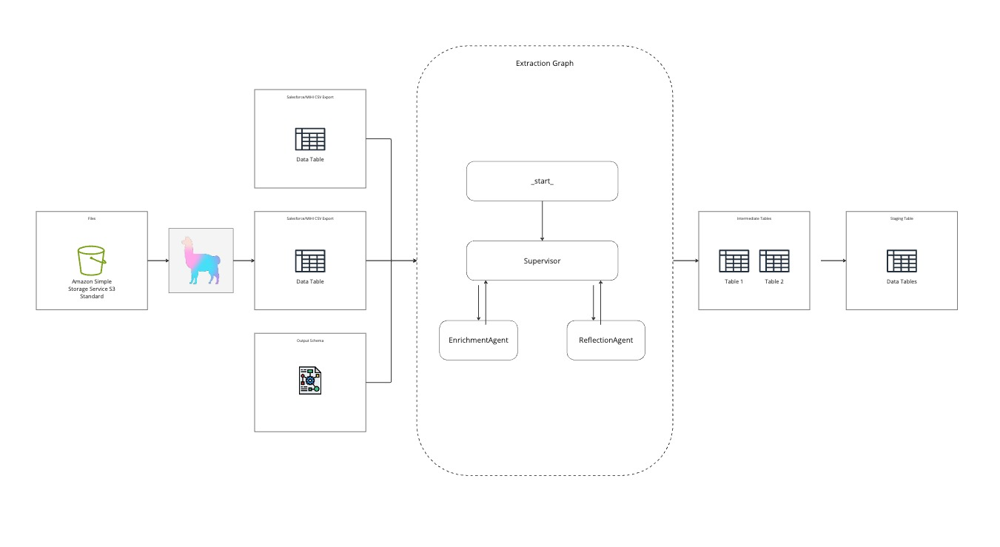

# Employee Contract Data Extraction Agent

## Overview

This project is an automated agent designed to extract, normalize, and enrich employee data from multiple sources. The agent processes a list of employee IDs to:

- Retrieve employee contracts from an Amazon S3 bucket.
- Use a Language Model (LLM) to extract structured data according to specified schemas.
- Extract additional data from Salesforce and Mihi systems.
- Normalize all data and stage it for further processing.

A reflection agent ensures the accuracy and sufficiency of the extracted data. This tool facilitates the progressive migration of worker data to a new System of Record, enhancing operational efficiency and contributing to increased business profitability, scalability, and success.

## Features

- **Automated Contract Data Extraction with Reference Paragraphs**: Extracts and normalizes data from employee contracts, including the specific paragraphs where the data is found.
- **Data Normalization**: Converts all extracted data into a consistent format and language (English) to simplify analysis and integration.
- **Data Staging**: Stores all extracted and normalized data in staging tables, ready for further processing, validation, and merging.

## Architecture

### Workflow Steps

1. **Employee ID Input**: Reads a list of employee IDs from a CSV file located in the `/data` folder.
2. **Contract Retrieval from S3**: Fetches each employee's contract from the S3 bucket. Contracts are stored in Markdown format, converted from PDF using LlamaParse.
3. **Data Extraction**:
   - **Contracts**: Uses an LLM to extract specified data elements and their source paragraphs.
   - **Salesforce**: Retrieves relevant employee data.
   - **Mihi**: Extracts additional employee data.
4. **Data Normalization**: Converts all data to a consistent format and language (English).
5. **Data Staging**: Stores the normalized data in staging tables.
6. **Data Post-Processing**:
   - **Data Team**: Compares data sources, flags anomalies, and merges data.
   - **Manage Team**: Integrates the data into the Manage App.
7. **Output**: The final, validated data is ready for use in downstream applications.

### Architecture Diagram

_This diagram illustrates the data flow from employee ID input to contract retrieval, data extraction from various sources, data normalization, staging, post-processing, and final output generation._

## Tech Stack

- **Programming Language**: Python or TypeScript
- **LlamaParse**: Converts PDF contracts to Markdown for easier processing.
- **LangGraph**: Manages agent orchestration and workflow.
- **OpenAI GPT-4o Model**: Provides advanced language understanding for data extraction.
- **Amazon S3**: Serves as the storage system for contracts and source files.

## Installation

1. **Clone the Repository**
   ...
